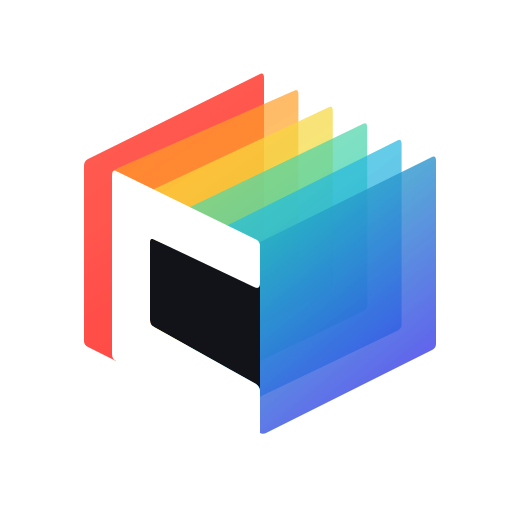

  

<h1 align="center">ChroViewer</h1>

Initially based on [ChroMapper's](https://github.com/Caeden117/ChroMapper) map previewer, ChroViewer is a browser based Beat Saber map and replay viewer

## Getting Started

See [SETUP.md](SETUP.md) for the local development guide

## Contributing

See [CONTRIBUTING.md](CONTRIBUTING.md) for code standards and pull request expectations

## Attribution and License

ChroViewer's environment data, preview math, shaders, materials, lighting and related rendering code are derived from [ChroMapper](https://github.com/Caeden117/ChroMapper) by Caeden117 and contributors under GNU GPL v2. Caeden117 approved this preview-side porting work

ChroViewer is distributed under [GNU GPL v2](LICENSE) (`GPL-2.0-only`)

Third-party asset attributions are listed in [ATTRIBUTIONS.md](ATTRIBUTIONS.md)

ChroViewer is an unofficial community project. It is not affiliated with or endorsed by Beat Games, Meta, ChroMapper or BeatSaver. Any Beat Saber names / assets belong to their respective owners
